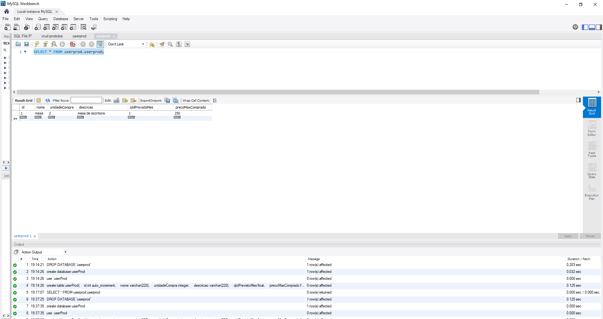

# SWII5  - CRUD in Servlet Product

Uma aplicação CRUD (Create, Read, Update and Delete).

## Requisitos

Atenção:

[x]  Obrigatório o nome da dupla nos arquivos .java na forma de comentários.

[x] Deverá entregar o projeto em forma compactada (toda a pasta)

[x] Mandar junto um print de tela com os dados populados no banco de dados e na
apresentação dos funcionários desta atividade.

[x] Diferencial: Criar uma página específica para créditos da dupla.

## Demonstração

Os prints da tela:

Tela com os alunos

Crud com formulario

Crud com lista produtos

Dados populados no banco de dados MySQL

Link do projeto funcionando: 

## Autores

- Andreza do Nascimento Pessoa  Matricula: Cb3012191
- Lidiane Souza Soares          Matricula:CB3012026

